## 소개
- 이름: 손민성
- 취미: 웹크롤링,NLP,엑셀프로그래밍(데이터 수집후 정리된 csv 형태로 가공 작업)
- Email: iconms12@naver.com

```
현재:
- 경력쌓는중..
- 공학 영어 공부중
- 수학 공부 다시하는중
- 정보처리기사 실기 준비중
- 다른 자격증 뭐할거 있나 기웃거리는중

하고싶은것:
- 깃허브 잘하고싶다.
- 스택오버플로우에서 떠들고싶다
```
## 학력
- 한림대학교 빅데이터 공학과 졸업
---

## 관련경력
- 주식회사 Dlog 2021/01 ~2022/01

## 보유중인 자격증
- 정보처리 기사(실기 준비중)
- 정보처리 기능사
- GTQ
- ITQ

# 다뤄본 경험이있는 언어와 개발환경

## 언어
- Java
- Python
- C#
- C++
- javascript
- ionic
- nodejs
- html
- cordova
- linux
- PHP

## 개발환경
- jupyter notebook
- visual studio
- android studio
- visual code
- eclipse
- pycham
- linux bash
- xcode
- ionic framework
- unity
- xcode


## 운영체제
- Windows
- ubuntu
- macos(m1)


## 형상 관리
- github
- svn

## 그외
- docker
- elastic search
- 네이버 클라우드
- google 클라우드
- 구글 콘솔
- ios 앱 스토어

---
## 모바일 프로젝트

### Android
- Unity를 이용한 간단한 2D,3D게임 프로젝트를 진행하였습니다.

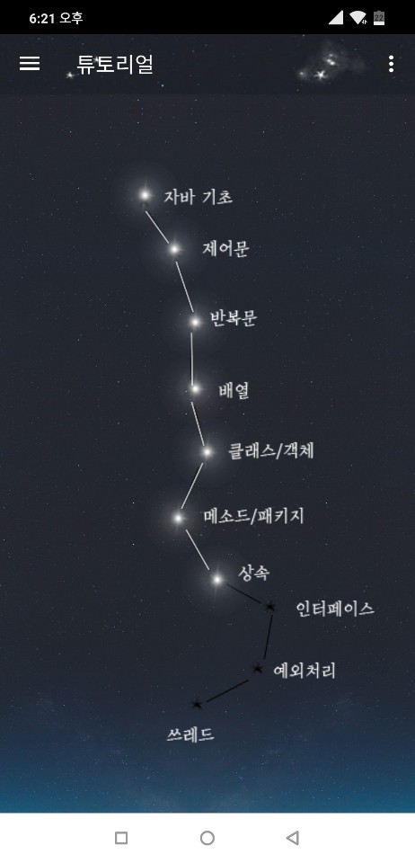


### **자바 학습 어플리케이션 프로그램 제작**
- Android studio
- javascript
- firebase

<br>
<br>
<br>

### **Android studio를 이용한 랜덤채팅 애플리케이션**
- Android Studio
- java
- firebase
- Mysql

<br>
<br>
<br>

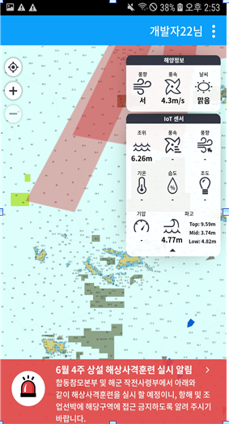

### 하이브리드 앱
- ionic framework를 이용한 AIS 항해선박 항적 예측 애플리케이션
- IOS,Android 빌드
- 주요 기능
<br>
1.canvas를 이용한 해당 항해구역내의 선박및 예측경로 항해경로 표출<br>
2.push 기능을 이용한 위험경보(항해경보구역, 충돌예측 경보)<br>
3.LSTM 시계열 예측을 통한 항행경로에 따른 충돌 예측 알고리즘 생성<br>
4.WAS를 이용한 데이터 송수신및 서버단 데이터 처리<br>
5.공공 API를 이용한 해당 해역의 공공데이터 및 설치된 센서 데이터를 수집하여 앱에서 표출<br>
6.일반 사용자 항해기록을 서버에 저장(송수신간 암복호화)<br>
etc.웹 대시보드를 모바일용 으로 기능및 해상도 조절 표출<br>
<br>
<br>
<br>

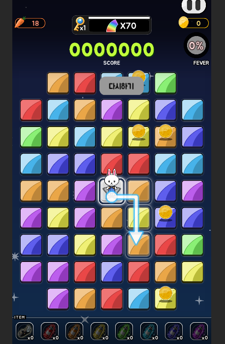

### 유니티 2D 퍼즐 게임 제작
- IOS,Android 빌드
- 주요기능
<br>
1.평면 형태에 1개의 scene으로 이루어진 화면에서 각 버튼별로 저장되있는 object를 호출하는 식으로 장면전환이 이루어짐 
<br> 2. 뒤끝베이스 (https://www.thebackend.io/) 를 이용한 게임 서버 구현
<br> 3.퍼즐의 오브젝트별 설정을 통한 쉽게 유지보수가 가능한 형태로 설계 
<br> 4.로컬데이터 암복호화
<br> 5.인앱결제와 광고구현
<br> 6.애플및 구글 동시 출시
<br> 그외 게임내 기능 구현
<br>
<br>
<br>


<br><br>
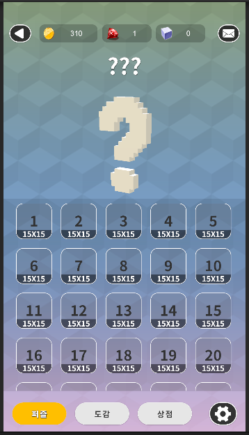
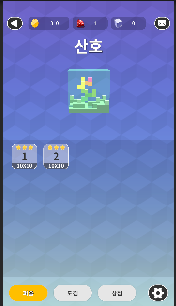
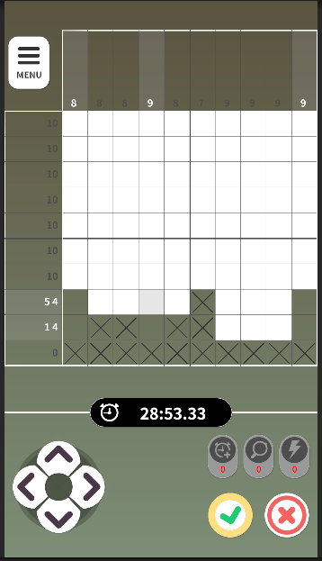
### 유니티 2D 네모네모 로직 게임 제작
- IOS,Android 빌드
- 주요기능
<br>
1.네모네모로직형 퍼즐게임 3D오브젝트를 이용하여 입체감을주고 실제 회전 확대와같은 효과를 주어 소유욕을 증가시킴
<br>2.flask와 Apache를 이용한 RestAPI 서버 제작
<br>3.로컬데이터 암복호화
<br>4.인앱결제와 광고구현
<br>5.푸시알림 구현
<br>6.애플및 구글 동시 출시
<br> 그외 게임내 기능 구현

<br>
<br>


<br><br>


---
## AI 프로젝트 <br>

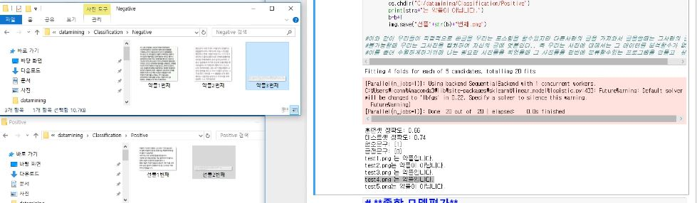

### **이미지 데이터를 String으로 바꾸어 분류문제 해결**
- python 3.6
- konlpy
- openCV

<br>
<br>

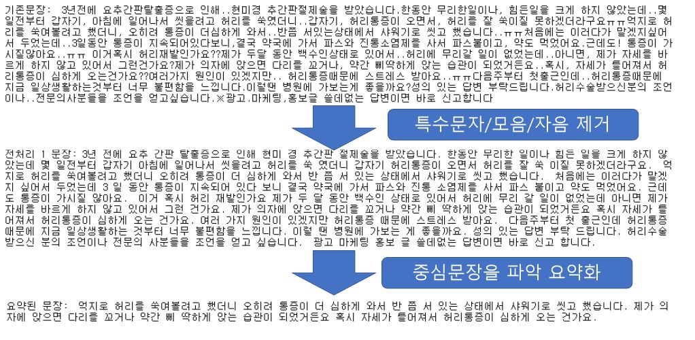

### **단순한 분류문제를 사용한 Q&A프로그램 제작**
- Python 3.7
- konlpy
- tensorflow

<br>
<br>

### **elastic search를 이용한 nlp 처리**
- Python 3.7
- ubuntu elastic search
<br> 1. logstash
<br> 2. elastic search api
- tensorflow
- pandas

<br>
<br>


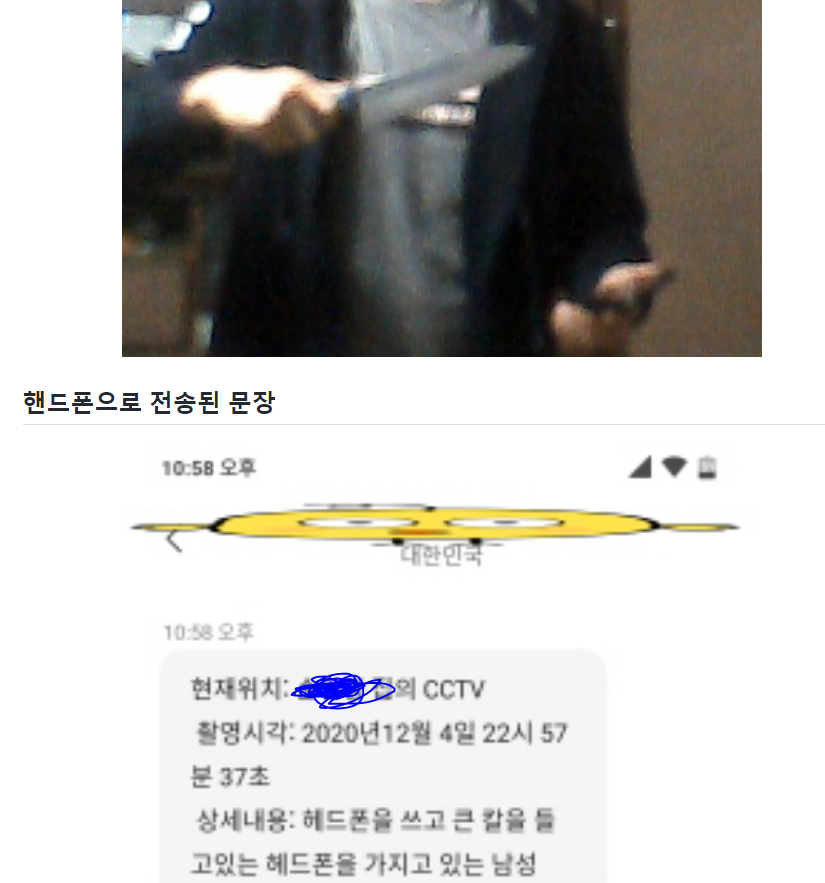

### **realtime_crime_detection**
자세한 사항으로 [이동](https://github.com/iconms12/Image_Captioning)
- tensorflow
- linux
- gpu-server
- python
- yole-V4


---
## Server 프로젝트
데이터베이스 서버 및 웹서버를 다루어 네트워크를 구축할수있습니다.

- 네이버 클라우드
- Firebase
- Azure
- ubuntu (apache2,django)를 이용한 서버 구축
 <br> 1. WAS 서버
 <br> 2. web 서버
 <br> 3. GPU(딥러닝) 서버 구축
 <br> 4. crontab 을 이용한 주기적 백업및 알림 전송
- mariaDB를 이용한 DB서버 (mysql문)

- flask를 이용한 restapi 서버(게임서버) 구축

- elastic search를 이용한 검색엔진 구축

### TODO
**새로운것**을 배우는건 언제나 즐거운 일입니다. <br/>

----
## 그외

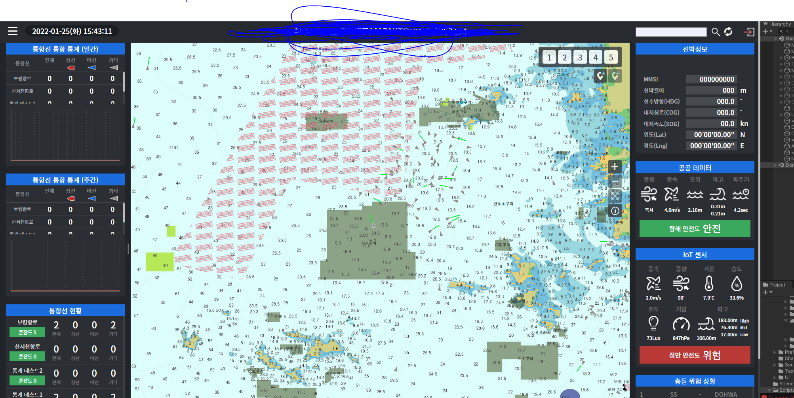

### **선박안전 웹사이트**

<br> - Apahe
<br> - django
<br> - html
<br> - Mysql
<br> - mariaDB
<br> - Python
<br> - javascript
<br>
<br>
<br>


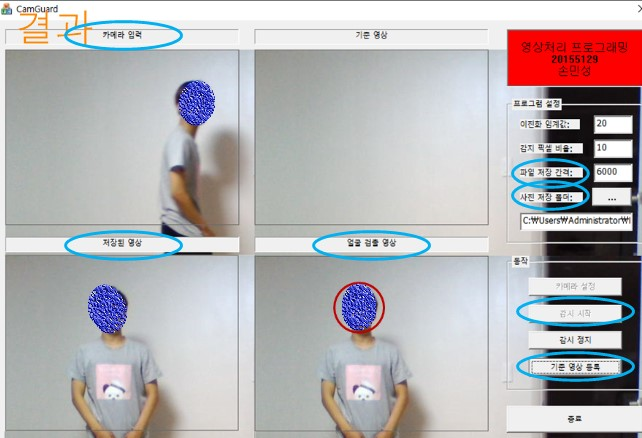

### **C++를 사용한 도난경보 애플리케이션**
- C++

<br>
<br>


### **크롤러를 이용한 다양한 플랫폼 자료 수집**
- 주요 내용 
<br> 분당  1천건이상의 크롤링 속도를 보장하지않는 플랫폼 크롤러는 아래 내역에서 제외함

- 수집한 플랫폼 내역
<br> 1.네이버(블로그,뉴스(본문,댓글),쇼핑)
<br> 2.다음(블로그,뉴스)
<br> 3.카카오스토리
<br> 4.인스타그램
<br> 5.쿠팡
<br> 6.gmarket
<br> 7.인터파크
<br> 8.티스토리
<br> 
<br> 
- 사용한 모듈
<br> 1.selenium
<br> 2.request
<br> 3.beautyful soap
<br> 4.pandas
<br> 5.공식 api

- 사용된 언어 
<br> Python


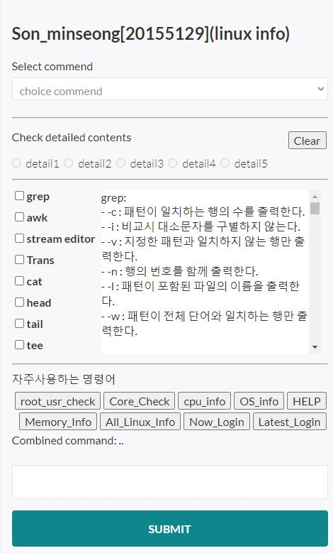       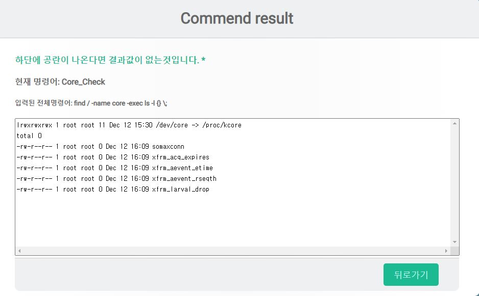 
### php와 javascript를 이용한 실시간 서버정보확인 사이트 
- PHP<br>
- JavaScript

---
<br><br>
## 그외 할줄아는것 <br>
애플 앱스토어 앱등록 <br>
구글 플레이 콘솔 앱등록 <br>
인앱결제 시스템 <br>
영수증 검증<br>
구글 애드몹 광고 <br>
외부 플러그인 사용법 숙지 등 


### 수상경력 
교내 공모전 3회수상
- 교과 SW 공모전 우수상,장려상수상
- 캡스톤 디자인 동상

